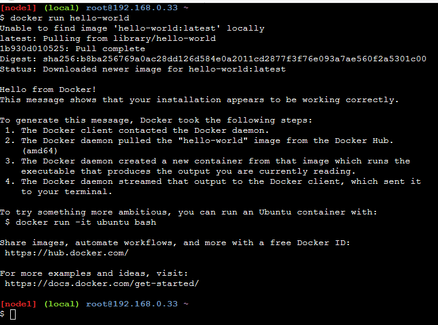

# Run the Hello-World Docker image from DockerHub

```
$ docker run hello-world
```



* It first searches for **hello-world** Docker image in the local machine but if it does not exists, it pings the Docker Hub registry and pulls the best matched repository with the same name.

## Syntax: Run a docker container from docker image

```
$ docker run {image name}
```

