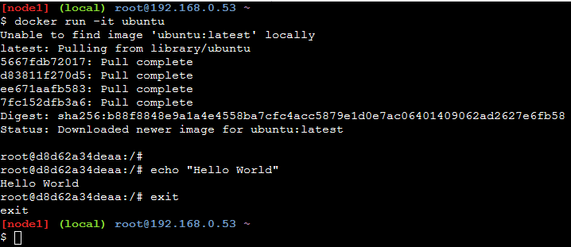

# Pull an Ubuntu Linux image and run it in Interactive mode

```
$ docker run -it ubuntu
```



To exit the container, use the **exit** keyword.

# Seeing the active (Up) docker containers

```
$ docker ps
```
or
```
$ docker container ls
```


Shows the active containers with following
* Repository
* Tag
* Image ID
* Date of creation
* Size in Mb

Here, we see no active containers because after exit, the container is destroyed.
But is the container cached in memory for faster creation next time?
Yes, it can be seen using following command:

```
$ docker ps -a
```

It shows the Docker containers created till now irrespective or being up or being exited.

# Docker Images in the local machine

Docker pulls(downloads) the docker machines to the local machine then accesses it to create containers.
Storing the docker image in local FS is important because they can be easily cached next time.

```
$ docker images
```
or
```
$ docker image ls
```


