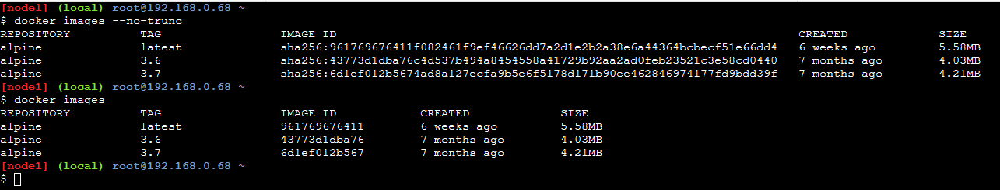
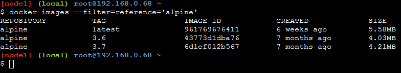

# Pulling Docker Images from Docker Hub

```
docker pull {imagename}:{Tag}
```

* Tag is the version number like 1.0 etc.
* If tag is not specified, Docker pulls the latest image.

# Pulling Multiple versions of the same image

Here, we pull the alpine Linux, the minimal version of Linux without any binaries and libraries installed.

```
docker pull alpine-latest 
docker pull alpine:3.6
docker pull alpine:3.7
```


# See all the Docker images on local machine

```
docker images
```


# Seeing the entire Image Id of the Docker Images

```
docker images --no-trunc
```



# Searching for Docker Images with a pattern

```
docker images --filter=reference='pattern'
```


