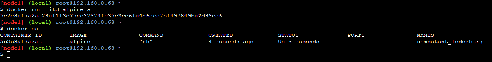
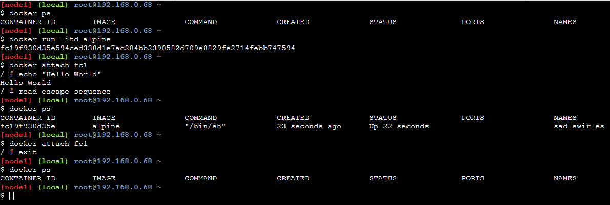

# Open Container in Interactive Mode

**Docker Run command we used till now:**

```
docker run {image name}
```

It created a container that performed its task and deleted after execution.
What if we want to retain a container in active state so that it shows in UP state on **docker ps**.

```
docker run -itd {image name}
```

* it: Interactive mode
* d: Daemon or detached mode: won't open container in front but opens it as a daemon (background process)

# Stopping an active Docker Container and Removing it

## Docker Stop

If Docker container is up and running we can stop it using docker stop

* Check Running Docker containers

```
docker ps
```

* Stop Docker containers

```
docker stop {container name, container id or first three letters of container id}
```



## Docker rm

Docker stop just stop an container from execution -> changes its state from UP to Exit state but still its temp files are stored for caching
This can be seen by using the following command:

```
docker ps -a
```

We can remove that using the following command:

```
docker rm {container name or id or first three letters of id}
```


# How to Enter a Daemon container to Interactive mode

```
docker attach {Image ID or first three letters}
```

# How to exit and destroy container

```
# exit
```

# How to exit with container still in UP mode

**Press Ctrl+P+Q**


