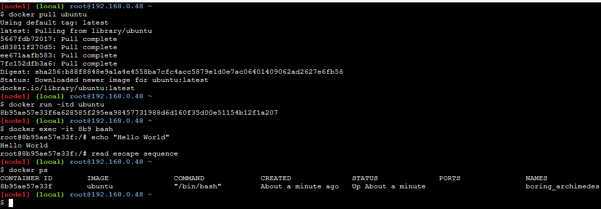

# Alternate and more conventional way to interact (enter) with Docker Containers

```
$ docker exec -it {container id} bash
```

## Steps:

1. Pull a docker image
```
$ docker pull ubuntu-latest
```

2. Open the docker container in Detached mode
```
$ docker run -itd ubuntu-latest
```

3. Check the docker image ID
```
$ docker images
```

4. Attach to the docker container
```
$ docker exec -it {image id} bash
```


