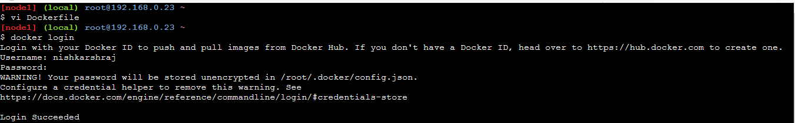
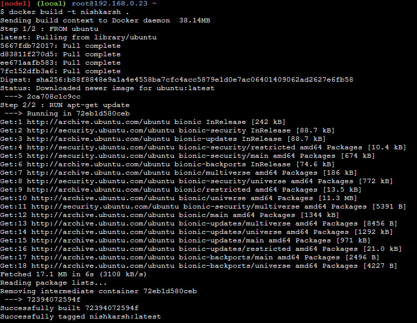
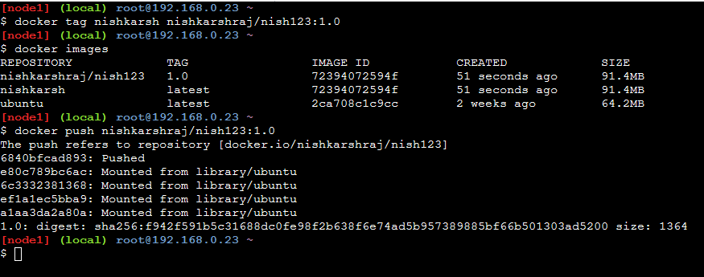
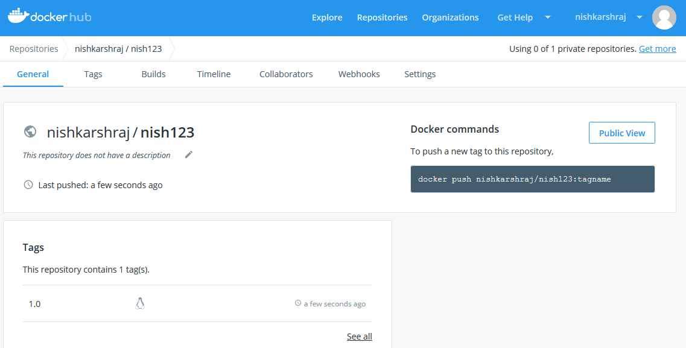

# Pushing the Docker Image to Docker Hub

1. Login to you Docker account:

```
docker login
```

2. Build your docker image using Dockerfile

```
docker build -t {docker image name} .
```

3. Create tag for your docker image

```
docker tag <<image name>> {docker hub username}/{docker image name you want on remote repo:version}
```

4. Push the image to docker hub

```
docker push <<imagename:version>>
```








