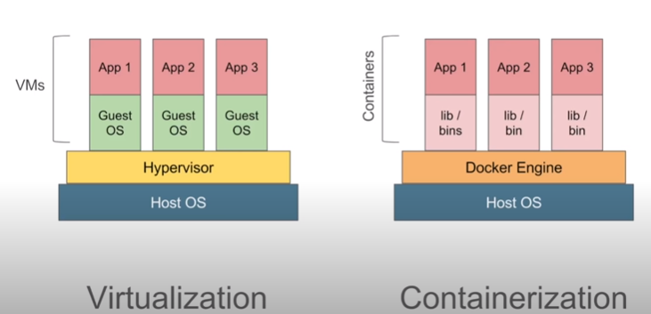

# More about Dockers

## Docker Basics

* Portability - Same working on different platforms and devices.

* Docker is used throughtout the SDLC Lifecycle but its most important significance plays in deployment.

* Software Stack - A software consists of 
1. Frontend
2. Backend
3. Database
4. Dependencies and Environment configurations
We have to configure all of them in different environments to run it everywhere.

* Containers are standard packaging - organization - transport - portability.

## Docker Architecture

### General Workflow of Docker

* Dockerfile - Docker Image - Docker Container - DockerHub
* Pull Image in different devices via the repository and run the container anywhere.

### Containerization vs Virtualization

* Hypervisor vs Container Runtime
* Guest OS vs Parent Kernel sharing
* Resource allocation vs On demand resource allocation



### Docker Architecture - Client Server Architecture

* Client - Command Line Interface
* Server - Docker Daemon - containers run on server => Server = Docker Daemon + Containers
* Docker Engine - Client + Server
* Docker Client and Server interact via commands or Rest API.

## Advantages of Docker
* Build Once - Run everywhere
* Portable - Supported by AWS, GCP etc
* Easy to Share - central hub repository
* Version Controlling
* Isolation
* Standard Packaging 
* Improved productivity

## Docker Installation on Linux 64 bits

* Connect to Linux

* Install Docker

```
$ sudo apt-get -y update
$ sudo apt-get -y install docker
$ docker --version
$ docker info
```
* Start Docker

```
$ sudo service docker start
$ docker info
```

* Add User to Docker

```
$ sudo usermod -a -G docker [username]
```

* Stop Docker
```
$ sudo service docker stop
```

* Uninstall Docker
```
$ apt remove docker
```

### Resources

https://get.docker.com/
https://docs.docker.com/engine/install/binaries/

## Basic Docker Commands

### Basic commands

* Version, client, golang version - detailed

```
$ docker version
```

* One line Docker version information

```
$ docker --version 
$ docker -v 
```

* Detailed Docker information along with current state on parent OS

```
$ docker info
```

* Help command to know about other commands
```
$ docker --help
```
```
$ docker [command] --help
```

* Login to DockerHub

```
$ docker login
```

### Images commands

* Docker Pull

```
$ docker pull [image name] # Fetches from repository
```
```
$ docker images -q # All IDs of image
```
```
$ docker images -a # All information of cached images
```

* Delete images
```
$ docker rmi [-f] [space separated image names or ID]
```

### Containers commands

* PS - list containers
```
$ docker ps # Running containers
```
```
$ docker ps -a # All containers
```
```

* Run - Check image locally, if not present, pull from Hub and launch a container.
```
$ docker run [image name]
```
```
$ docker run -it [image] # Interactive mode
```

* Docker start
```
$ docker start [image name] # Not running but fully provisioned
```

* Docker Stop
```
$ docker stop [image name]
```

### System commands

* Stats command - Resource utilization
```
$ docker stats
```

* Disk utilization

```
$ docker system df 
```

* Prune - delete all unused data but not the dangling images
* Prune --all (dangling images - not having any running container)
```
$ docker system prune # Outputs total resource regained especially in terms of memory
```

## Docker Images

### What are Images

* Images are template to create docker containers
* Containers are runtime artifacts


```
$ docker images # list images
```
```
$ docker images --help # Check the basic command usage
```

### How to Pull an image
```
$ docker pull [image name] # Pulls latest image by default
```

```
$ docker pull [image name]:[tags] # Downloads specific tags
```

```
$ docker images -q # Shows all numeric IDs of local images # --quiet
```

```
$ docker images -f "dangling=false" # Filter -- filter
```

```
$ docker image --all # All images
```

### How to run a container from the image

```
$ docker run [image name]
```

```
$ docker run -it --name [container name] [image] [bash]
```

### Basic Commands

* Inspect Images - Shows layers - Images are STACK of layers.
```
$ docker inspect [image name]
```

* Inspect Containers
```
$ docker inspect [container name]
```

* Stopped related containers needed to delete image - use force
```
$ docker rmi [-f] [image name]
```

## Docker Containers
* Running instance of Docker Images


### How to create containers
```
$ docker run [image name] # Inbuilt Pull feature
```

```
$ docker ps # Running containers
```

```
$ docker ps -a # All containers
```

```
$ docker run --name [name of container] -it [image name]
```

* Start containers
* Stop containers
* Pause containers - lock container - takes on input from user and stops every tasks!
```
$ docker pause [container name] # From another terminal
```

* Unpause containers
```
$ docker unpause [container name]
```

* Top command - PID, commands, name etc.
```
$ docker top [container name]
```

* Statistics
```
$ docker stats [container name]
```

* Attach to running container - attach to start or running state only
```
$ docker attach [container name or ID]
```

* Kill a container - Running containers only
```
$ docker kill [container name or ID]
```

* Remove container
```
$ docker rm [container name or ID]
```

* History of containers linked to local image
```
$ docker history [image name]
```

## How to run Jenkins on Docker Containers
* How to Start Jenkins on Docker
* How to set Jenkins home on parent OS

* Pull the Jenkins Image
```
$ docker pull jenkins
```

* Run the Docker container to launch Jenkins on parent OS
```
$ docker run -p 8080:8080 -p 50000:50000 jenkins # [Export Host port]:[Server port]
```
* 8080: Web Brower hosting
* 50000: Jenkins API Communication linking

* Create a persistent storage for Jenkins - Docker Volume
```
$ docker run -p 8080:8080 -p 50000:50000 -v [local storage]:[destination storage] jenkins
```

* Unlock Jenkins home on parent OS web Interface
* Set a password - Settings - Users - Configure - Change Password
* Create a simple job to execute Shell command - `$ls`
* New terminal since Jenkins running via Docker on other terminal
* Stop the Docker container of Jenkins
* Check if the job present on the local storage
* Delete the container permanently
* Create another container with same Jenkins home directory of local parent!!

**BCD!! Jenkins jobs and different configurations are kept intact when we use the same local storage for linking**

**BCD!! Volume Mapping - Create Volume via Docker CLI - "/var/lib/docker/volumes" but we can directly link a local folder as well.**

## Dockerfiles

Text file with instruction to **build** the Docker Images

```
$ vim Dockerfile
```

```Dockerfile
# Comments
FROM [image name]/[SCRATCH] # Scratch is an empty image
MAINTAINER [User name] <[Email]> # Optional
RUN [command] # Execute on Build
CMD ["echo","Hello World"]# Execute on container launch
```

* Build the Docker Image
```
$ docker build [path]
```

* Build Image with tag
```
$ docker build -t [image name] [path]
```

* Run the image
```
$ docker run [image ID]
```

### References

https://github.com/wsargent/docker-cheat-sheet#dockerfile

https://docs.docker.com/engine/reference/builder/#environment-replacement


