# Kubernetes 101

## Introduction

* Greek word Kubernetes - Helmsman - Orchestrator
* K8s - 8 characters between K and S in Kubernetes

### What is Kubernetes
* Container Management / Orchestration tool
* Developed by Google
* Managed by CNCF
* Open Source
* Written in Golang
 

### What is Container Orchestration Engine

* **Container Management/Orchestration Tool:** It is used to automate the deploying, scaling and management of containers or group of containers.

**CMS Tools Example:**
1. Kubernetes
2. Apache Mesos Marathon
3. Docker Swarm

**CMS Manages:**
1. Deployment
2. Scheduling
3. Scaling
4. Load Balancing

### Why Kubernetes
* Different management needs of CMS
1. Deployment
2. Scheduling
3. Scaling
4. Load Balancing
5. Batch execution
6. Rollbacks
7. Monitoring

* Organizing large number of containers

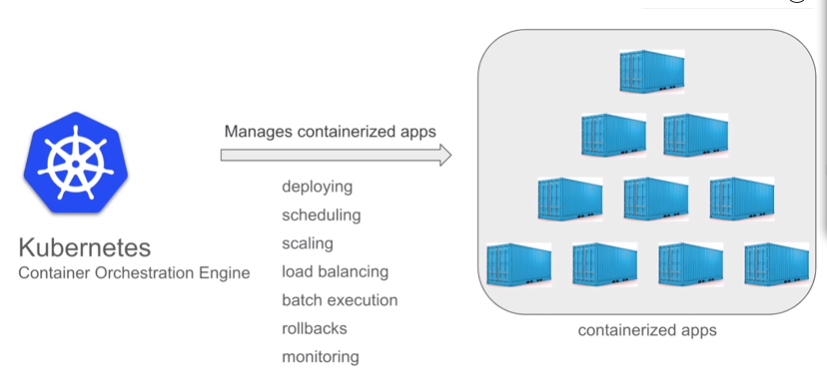

## Features of Kubernetes

### 1. Automatic Bin Packing

* Servers are also called as bins.
* We have to optimize the packing of software on servers in most efficient way.
* Automated packing and scheduling based on specified requirements and resources available.

**Pods:** Collection of containers

* Kuberenetes does not have direct communication with container
* Kubernetes wraps container or group of them in a pod.
* Pod or group of pods are stored on node.

**Nodes:** Working or Master device. Pods run on nodes.

* We can specify the reosources needed for pods and containers and these specifications are used by Kubernetes for better packing.

### 2. Service Discovery and Load Balancing

* **Pods:** Consists of
1. application container(s)
2. volumes
3. Unique IP

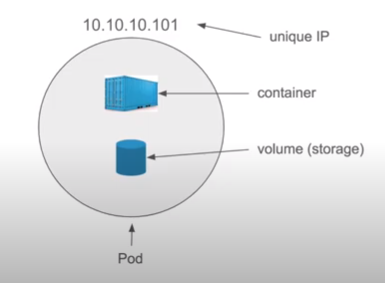

* **Services:** Collection of related Pods in a higher-level wrapping.
Uniquely identified by DNS name.
**Services can consist of replica of same pod which can be used for load balancing.**
Services are used for Network and communication.

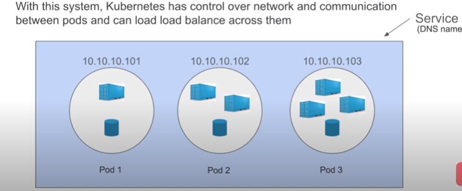

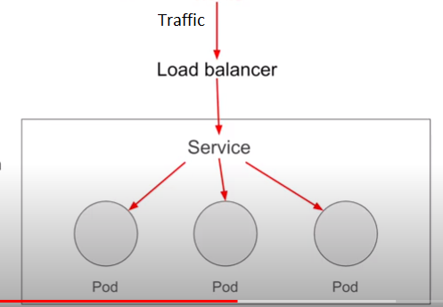

### 3. Storage Orchestration

* Volume definition inside pods.
* One volume for one pod
* Volume can be:
1. Docker volume
2. Local Storage
3. Cloud storage
4. Network Storage (NFS)

### 4. Self-Healing

**Self Healing done by Replication Controller**
* If container fails - restart container
* If node dies - replace and reschedule containers on other nodes
* If container does not respond to health check - Kill the container and use alternate container

### 5. Automated Rollouts and Rollbacks

**Rollout:** Deploy changes to the application or its configuration

**Rollback** Revert the changes and restore to previous stable state.

* Kubernetes does automated rollout and rollback, that too by guarenteeing **ZERO DOWNTIME**

### 6. Secret and Configuration Management

**Special Kubernetes Objects: Difference between them - Isolation from containers**
1. Secrets
2. Config Maps

1. Secrets
* Sensitive data
* Managed and created outside pods but in same node
* Makes sensitive data portable and easy to manage

2. ConfigMaps
* configuration
* Managed and created outside pods but in same node
* Makes configurations portable and easy to manage

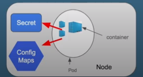

**Notes:**

* Special Kubernetes objects are stored in ETCD, a key-value datastore.
* Max size limit for Secrets file is 1 MB

### 7. Batch Execution

**Batch jobs:** Requires an executable/process to run to completion.
* Kubernetes uses **Run to completion** jobs for batch processing
* One job creates one or more pods.
* During job execution, if any container or pod fails, **Job Controller** will reschedule the container, pod or node.
* Can run multiple pods in parallel
* Scaling pods up/down.
* After the completion of job, pods will move from running to shut down state.

### 8. Horizontal Scaling
* Scale up or down.
* scaling can be done by:

1. Command line
2. Automatically based on CPU storage
3. Kubernetes UI (Dashboard)

* Tools involved:
1. Replication Controller
2. Manifest file
3. Horizontal Pod Autoscaler

**Replication Controller (RC or RCS)** Creates pods/containers and their specified amount of replicas.
It ensures that the specified amount of replicas always exists and if some container/pods go down, they are automatically replaced.

**Manifest file:** It specifies the number of replicas to be maintained by the Replication Controller

**Horizontal Pod Autoscaler:** automatically scales the number of pods to be maintained by observing the CPU Utilization with custom metrics.
* Monitors every **15 seconds** (default time; can be modified)

**Note: RC is used for maintaining replicas and two other components tell the amount of replications**
* Manifest file is static file with fixed number of replicas
* Horizontal Pod Autoscaler gives replication factor dynamically based on resource availability.

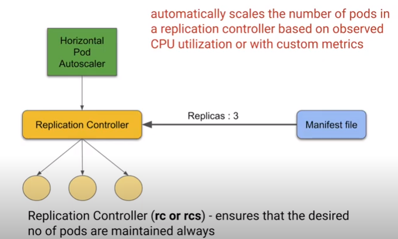

## Architecture of Kubernetes

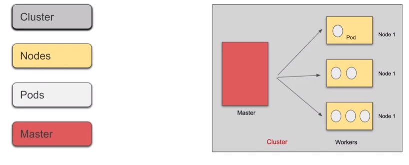

**Analogy:** Master-Worker architecture
* Master - Manager node
* Slaves - Worker nodes
* **Cluster:** Master nodes + worker nodes (formerly also refered as Minions)
* When we deploy Kubernetes, we get a cluster.
* A cluster consists of machines called nodes.
* A cluster has at least one worker node and at least one master node 
* More than one masters can be there - failover and higher availability
* More than one clusters can be there
* One node contains multiple pods

**Node:** Physical Machine/ Virtual Machine/ Cloud
* Node consists of Pods
* Pods consists of containers

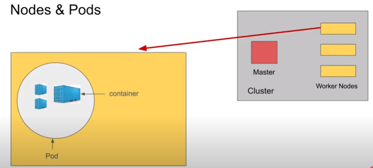

**Note:** In Latest Kubernetes version (v1.16):
* Maximum Nodes: 5000
* Maximum Pods: 1,50,000
* Maximum Containers: 3,00,000
* Maximum Pods per node: 100

### More about Kubernetes Architecture

#### 4 Components of Master Node

* Responsible for managing the cluster
* Monitors the pods and nodes
* when the node fails, moves the workload of the failed node to another workload.

**Components of Master Node**

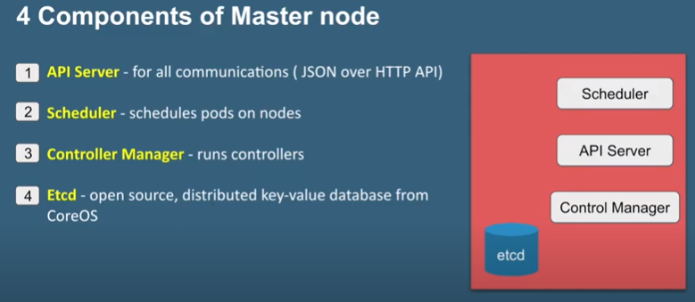

**1. API Server:** for all communications (JSON over HTTP API)
* Front-end  for Kubernetes Control Panel
* User can access API Server using
i) Command line: **KubeCTL** - KuberCTL is written in Golang
ii) Dashboard Kubernetes UI
 
**2. Scheduler** - schedules pods on nodes
* Schedules pods across multiple nodes
* Scheduler obtains information about pods from ETCD via the API server and resource usage data from each worker.

**3. Controller Manager** - runs controller
* Different controllers

**3.1) Kube-controller Manager**
* Tells scheduler to act when node becomes unavailable
* Ensure Pods count is same as replication factor.
* Create end points, service accounts and API Access Tokens
* Checks health of the container
* Controllers run watch-loops continuously to compare the cluster's desired state (from configuration) to its current state (obtained from etcd data store via the API Server)

* Different components of Kube-control manager

3.1.1) Node Controller - Monitor nodes - checks health

3.1.2) Replication Controller - checks replication factor

3.1.3) Endpoints Controller - maintains services and configurations

3.1.4) Service Account and Token Controllers - maintain accounts and namespaces

**Note:** All the controllers are separate processes but to reduce complexity, they are compiled into a single binary and run in single process.

**3.2) Cloud-controller Manager**
* Node becomes unavailable on cloud

3.2.1) Node Controller - checks health and delete inresponsive nodes

3.2.2) Route Controller - setup routes in cloud infrastructure

3.2.3) Service Controller - creating, updating and deleting cloud provider load balancers.

3.2.4) Volume Controller - creating, attaching, and mounting volumes.

* We can disable the controller loops by setting **--cloud-provider** flag to external.

**4. ETCD: Key-value database**
* Open Source
* Distributed Database from CoreOS
* Consistent
* Highly available
* Key-value Datastore
* Single source for secrets and configurations for Kubernetes Cluster
* Only the API Server can directly access the ETCD Store.
* ETCD can be stored on Master but it can be configured externally.

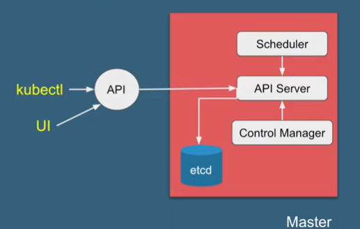

#### 3 Components of Worker Node

* Every worker node must have a container runtime, like Docker.

* Components of Worker Node

**1) Kubelet:** Agent on each worker node
* Interaction with Master node via API Server.
* Makes sure that pods are running
* **PodSpecs** are used for reference.
* Local Health Check - first tries to restart pod on same node or else creates another node.
* **Kubelet only manages containers made by Kubernetes and not the other ones in the system** 

**2) Kube-Proxy**
* Networking Agent - Core Networking component
* Interacts with the network 
* Exposes service to outside world
* Daemon process
* Interacts with master via API Server for updates to services and endpoints.

**3) Container Runtime:** Pods and Containers
- Docker, ContainerD, Cri-o, RKTlet etc.

* Kubernetes does not have own capability to create containers

#### Add-Ons

**1. Dashboard:** Web based user interace

**2. Monitoring:** Collects cluster-level container metrics and saves them to central data store.

**3. Logging:** stores container logs in a central log store for analysis

**4. DNS:** Each service is assigned a unique DNS

#### How Master and Worker Interact

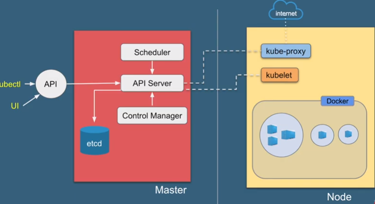

