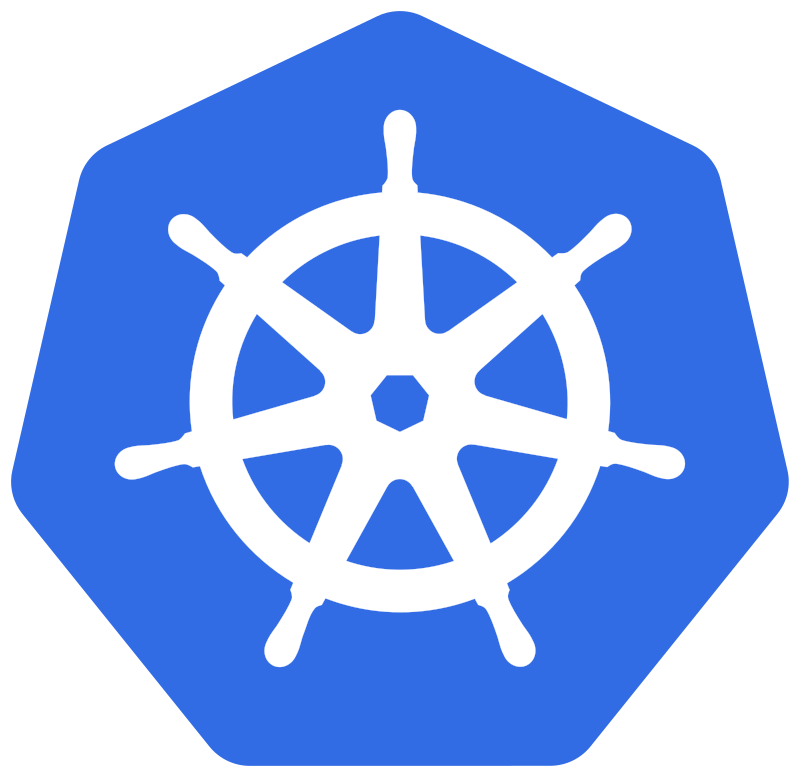

# Kubernetes

## The need for Kubernetes (or Orchestration tool in general)

For complex applications, for keeping modularity, large number of containers were needed to be managed where one container did one modular task in isolation and communicated with other via some API.
This management issue lead to the need of orchestration tool.
Kubernetes is one of the first and also the most used orchestration tool for containers developed by Google.

### Orchestration tools:

1. Kubernetes
2. Nomad
3. Docker Swarm
4. Mesos

## Features of Orchestration System

